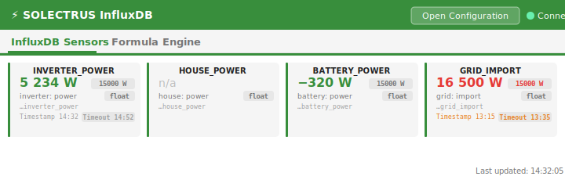

# SOLECTRUS InfluxDB Adapter -- Documentation

## Table of Contents

1. [InfluxDB Configuration](#1-influxdb-configuration)
2. [Sensors](#2-sensors)
3. [Sensors Overview Tab](#3-sensors-overview-tab)
4. [Forecast Sources](#4-forecast-sources)
5. [How-To: pvForecast with pvnode](#5-how-to-pvforecast-with-pvnode)
6. [Data-SOLECTRUS Formula Engine](#6-data-solectrus-formula-engine)
7. [Item Modes](#7-item-modes)
8. [Formula Builder](#8-formula-builder)
9. [State Machine Mode](#9-state-machine-mode)
10. [Data Runtime Settings](#10-data-runtime-settings)
11. [Monitoring & Buffer](#11-monitoring--buffer)
12. [Using Computed Values as Sensor Sources](#12-using-computed-values-as-sensor-sources)
13. [Debugging](#13-debugging)

---

## 1. InfluxDB Configuration

Open the adapter settings and go to the **InfluxDB** tab.

| Field | Description |
|-------|-------------|
| URL | InfluxDB 2.x server address (e.g. `http://192.168.1.10:8086`) |
| Organization | Your InfluxDB organization |
| Bucket | Target bucket for time-series data |
| Token | API token with **write** permissions |
| Polling Interval (s) | How often sensor values are collected (5-30 seconds) |

The adapter verifies the connection at startup by writing a test point. The connection state is shown in `info.connection`.

At the bottom of this tab you will find:

- A checkbox to enable the **Data-SOLECTRUS** formula engine (see section 5)
- A checkbox to enable **Expert Mode** (see section 2 -- Sensors)

---

## 2. Sensors

Go to the **Sensors** tab. The master/detail editor shows all configured sensors with their live enabled status.

### Standard Mode vs. Expert Mode

By default, the adapter runs in **Standard Mode**. The sensor list shows all preconfigured sensors (INVERTER_POWER, BATTERY_SOC, HOUSE_POWER, forecast sensors, etc.). In standard mode:

- **Editable**: Source State (ioBroker state) and Enabled checkbox
- **Read-only**: Sensor Name, Datatype, Measurement, Field, JSON Preset
- **Hidden**: Add, Delete, Duplicate buttons

This ensures that beginners can simply enable sensors and assign source states without accidentally changing the InfluxDB mapping.

To unlock full control, enable **Expert Mode** on the InfluxDB settings page. In expert mode:

- All fields are editable
- Sensors can be added, deleted, duplicated, and reordered
- JSON presets can be changed to custom mode

### Adding a sensor (Expert Mode)

Click **Add** to create a new sensor, then configure:

| Setting | Description |
|---------|-------------|
| Enabled | Activate/deactivate the sensor |
| Sensor Name | Display name (also used for the ioBroker state ID under `sensors.*`) |
| ioBroker Source State | The source state to read values from. Use the **Select** button to browse the object tree. |
| Datatype | `int`, `float`, `bool`, `string`, or `json` (JSON Array) |
| Influx Measurement | The InfluxDB measurement name (e.g. `inverter`) |
| Influx Field | The InfluxDB field name (e.g. `power`) |

At least one sensor must be enabled for data to be written.

### JSON Sensors (Forecast Data)

For forecast/weather data, set the datatype to **JSON Array**. Two preset modes are available:

| Mode | Description |
|------|-------------|
| **Automatic** | Auto-detects known fields in the JSON data (`y`, `clearsky`, `temp`) and writes each to the correct InfluxDB measurement/field. One sensor handles all detected forecast types. |
| **Custom** | Manually define the JSON timestamp field, value field, and InfluxDB type. Use this for non-standard JSON sources. |

**Auto-detection mapping:**

| JSON Field | InfluxDB Measurement | InfluxDB Field | Type |
|------------|---------------------|----------------|------|
| `y` | `forecast` | `watt` | int |
| `clearsky` | `forecast` | `watt_clearsky` | int |
| `temp` | `forecast` | `temp` | float |

Fields not present in the JSON are automatically skipped.

### How sensors work

1. The adapter subscribes to each sensor's source state
2. Values are mirrored under `solectrus-influxdb.X.sensors.*`
3. On each polling interval, current values are added to the write buffer (**Collect**)
4. Immediately after collect, the buffer is flushed to InfluxDB (**Flush**)

### Collect & Flush Architecture

Collect and flush run near-simultaneously without blocking each other:

1. **Collect** gathers all sensor values and writes them into the buffer
2. **Immediate flush** -- after collect, the flush is triggered on the next event-loop tick (no additional wait interval)
3. **Snapshot-and-swap** -- when the flush starts, the current buffer is taken as a batch and replaced with a new empty array. While the flush awaits the InfluxDB response, a concurrent collect already writes into the new (empty) buffer. The batch is never modified during the flush.
4. **Failure recovery** -- if the flush fails, the batch is prepended back to the current buffer in chronological order. No values are lost.
5. **Overlap guard** -- an `isFlushing` flag prevents multiple flush operations from running concurrently

### NaN protection

Invalid values (`NaN` for int/float, `null`/`undefined` for strings) are automatically skipped with a log warning.

### Negative values

SOLECTRUS does not accept negative values. If a sensor delivers a negative value after adapter start, a warning is logged **once**. The values are still sent to InfluxDB but may cause incorrect evaluations there. To fix this, check your source states or use the Data-SOLECTRUS formula engine with the **Clamp negative to 0** option.

### Field type conflicts

If InfluxDB reports a field type conflict (e.g. writing a float to an existing int field), the affected sensor is automatically disabled and the buffer is cleared.

---

## 3. Sensors Overview Tab

The **SOLECTRUS Overview** tab (accessible via the tab bar in the adapter section) provides a real-time at-a-glance view of all configured and active sensors and data items.



### Features

- **InfluxDB Sensors grid**: Shows all enabled sensors as compact cards in a responsive grid. Each card shows:
  - **Sensor name** and **data type badge** (`int`, `float`, `bool`, `string`, `json`)
  - **Current value** — live reading; *n/a* if no value has been received yet. Long values (e.g. JSON) are displayed in a smaller font so they remain readable on mobile devices.
  - **Measurement: field** — the target location in InfluxDB (separated by a colon)
  - **Source state** — the ioBroker state ID being read (truncated, full path shown on hover)
- **Formula Engine grid** (only shown when Data-SOLECTRUS is enabled): Shows all active computed items in the same card layout, with mode badge, current value, state ID, and formula/expression.
- **JSON Array preview**: For sensors with data type `json`, the value displays the **first array entry** followed by a count of additional entries (e.g. `{"t":1710000000000,"y":1250} (+543 more entries)`).
- **Auto-refresh**: The tab updates automatically every 5 seconds.

### Navigation

Click **Open Configuration** (top right) to jump directly to the instance configuration page of this adapter.

---

## 4. Forecast Sources

Forecast and weather data from pvforecast or similar adapters can be written to InfluxDB using **JSON sensors** on the Sensors tab. Simply set the datatype to **JSON Array** and use the **Automatic** preset.

### How it works

1. The adapter subscribes to one or more JSON states (e.g. `pvforecast.0.summary.JSONData`)
2. When the JSON state changes, the adapter parses the JSON array
3. In **Automatic** mode, the adapter scans each entry for known value fields (`y`, `clearsky`, `temp`)
4. For each detected field, a data point is written to InfluxDB with the correct measurement, field, and type
5. Because InfluxDB overwrites points with the same measurement, tags, and timestamp, **existing forecast points are automatically updated** when the source data changes

### JSON format

The source state must contain a JSON array of objects. Each object must have a timestamp field (`t`) and one or more value fields:

```json
[
  { "t": 1709035200000, "y": 1500, "clearsky": 2000, "temp": 12.5 },
  { "t": 1709038800000, "y": 2200, "clearsky": 2800, "temp": 14.0 }
]
```

### Default forecast sensors

The adapter comes with three preconfigured forecast sensors:

| Sensor | Measurement | Field | Type | JSON Field |
|--------|-------------|-------|------|------------|
| INVERTER_POWER_FORECAST | `forecast` | `watt` | int | `y` |
| INVERTER_POWER_FORECAST_CLEARSKY | `forecast` | `watt_clearsky` | int | `clearsky` |
| OUTDOOR_TEMP_FORECAST | `forecast` | `temp` | float | `temp` |

In **Automatic** mode, a single JSON sensor detects all present fields and writes them automatically. You only need to enable one sensor and point it to the JSON source state.

### Timestamp handling

- **Milliseconds** (number >= 10^12): Used directly
- **Seconds** (number < 10^12): Automatically converted to milliseconds
- **ISO string**: Parsed via `Date` constructor

---

## 5. How-To: pvForecast with pvnode

This section explains how to connect the **pvforecast** adapter to SOLECTRUS InfluxDB for forecast data.

### Prerequisites

- ioBroker with pvforecast adapter installed
- SOLECTRUS InfluxDB adapter installed and connected to InfluxDB

### Step 1: Choose your pvforecast backend

The pvforecast adapter supports two backends:

| Backend | Available Fields | Description |
|---------|-----------------|-------------|
| **Standard** | `y` (forecast power) | Basic PV power forecast only |
| **pvnode** | `y`, `clearsky`, `temp` | Full forecast with clearsky irradiance and temperature |

> **Important:** The fields `clearsky` (watt_clearsky) and `temp` are **only available with pvnode** as backend. The standard pvforecast backend only provides the `y` (forecast power) field.

### Step 2: Configure pvforecast

1. Install the pvforecast adapter in ioBroker
2. Configure your PV system parameters (location, modules, orientation, etc.)
3. If you want clearsky and temperature data, configure **pvnode** as backend
4. Verify that `pvforecast.0.summary.JSONData` contains a JSON array with forecast data

### Step 3: Enable the JSON sensor in SOLECTRUS InfluxDB

1. Open the SOLECTRUS InfluxDB adapter settings
2. Go to the **Sensors** tab
3. Find the sensor **INVERTER_POWER_FORECAST** (or any forecast sensor)
4. Set the **ioBroker Source State** to `pvforecast.0.summary.JSONData`
5. Enable the sensor (checkbox)
6. Save the configuration

The adapter will automatically detect all available fields in the JSON data and write them to InfluxDB:

- `y` -> `forecast.watt` (always available)
- `clearsky` -> `forecast.watt_clearsky` (pvnode only)
- `temp` -> `forecast.temp` (pvnode only)

### Step 4: Verify in InfluxDB

After the next pvforecast update, check your InfluxDB bucket for the `forecast` measurement. You should see the fields `watt`, and if using pvnode, also `watt_clearsky` and `temp`.

### Troubleshooting

- **No data written**: Ensure the sensor is enabled and the source state contains a valid JSON array
- **Only `watt` field**: Your pvforecast backend is not pvnode. Switch to pvnode for additional fields
- **Timestamps wrong**: Check that the JSON data uses Unix timestamps (seconds or milliseconds) or ISO strings

---

## 6. Data-SOLECTRUS Formula Engine

The formula engine is an optional feature that lets you compute derived values from any ioBroker states. Enable it by checking **Enable Data-SOLECTRUS (formula engine)** on the InfluxDB tab.

When enabled, two additional tabs appear:

- **Data Values** -- Configure computed items
- **Data Runtime** -- Global polling and snapshot settings

### Concepts

- **Items** are the building blocks. Each item reads one or more ioBroker states and produces an output state under `solectrus-influxdb.X.ds.*`
- Items can operate in three modes: **Source**, **Formula**, or **State Machine**
- Items can be organized into **folders/groups** for better overview
- Computed values can be used as sensor sources for InfluxDB storage

---

## 7. Item Modes

### Source Mode

Mirrors a single ioBroker state. Optionally extracts a value from a JSON payload using JSONPath.

| Setting | Description |
|---------|-------------|
| ioBroker Source State | The state to mirror |
| JSONPath (optional) | Extract a nested value, e.g. `$.apower` |
| Datatype | `number` (default), `boolean`, `string`, or `mixed` |
| Clamp negative to 0 | Replace negative output values with 0 |

### Formula Mode

Computes a value from multiple named inputs using a mathematical expression.

| Setting | Description |
|---------|-------------|
| Inputs | Named variables, each linked to an ioBroker source state |
| Formula expression | Mathematical expression using input variable names |
| Datatype | Output type |
| Clamp / Min / Max | Optional output clamping |

**Input configuration:**

| Field | Description |
|-------|-------------|
| Key | Variable name used in the formula (e.g. `pv1`) |
| ioBroker Source State | State to read the value from |
| JSONPath (optional) | Extract from JSON payload |
| Clamp input negative to 0 | Clamp this specific input before formula evaluation |

**Example formula:** `pv1 + pv2 + pv3`

### Available functions

| Function | Description | Example |
|----------|-------------|---------|
| `min(a, b)` | Smaller of two values | `min(5, 10)` = 5 |
| `max(a, b)` | Larger of two values | `max(0, value)` |
| `clamp(v, min, max)` | Clamp between bounds | `clamp(v, 0, 100)` |
| `IF(cond, then, else)` | Conditional | `IF(soc > 80, surplus, 0)` |
| `abs(v)` | Absolute value | `abs(-5)` = 5 |
| `round(v)` | Round to integer | `round(3.7)` = 4 |
| `floor(v)` / `ceil(v)` | Round down / up | `floor(3.7)` = 3 |
| `pow(base, exp)` | Power | `pow(2, 3)` = 8 |

### State functions (advanced)

These functions read ioBroker states directly in a formula, without defining named inputs:

| Function | Description | Example |
|----------|-------------|---------|
| `s("id")` | Read state as safe number (0 if unavailable) | `s("hm-rpc.0.power") + 100` |
| `v("id")` | Read state as raw value (string/number/boolean) | `v("mqtt.0.status")` |
| `jp("id", "$.path")` | Extract value from JSON state via JSONPath | `jp("shelly.0.json", "$.apower")` |

### Supported operators

`+`, `-`, `*`, `/`, `%`, `()`, `&&`, `||`, `!`, `==`, `!=`, `>=`, `<=`, `>`, `<`, `? :`

---

## 8. Formula Builder

Click **Builder...** next to the formula input to open the visual formula builder.

The builder provides:

- **Variables (Inputs)** -- Click to insert your named input variables
- **Operators** -- Click to insert operators with tooltips explaining each one
- **Functions** -- Insert function templates (`min`, `max`, `clamp`, `IF`)
- **State functions** -- Insert `s()`, `v()`, or `jp()` with a state picker dialog
- **Examples** -- Common formula patterns (PV sum, surplus, percentage, clamping, conditions)
- **Live preview** -- See the formula result in real-time (requires the adapter to be running)

The formula is always editable as plain text. The builder only inserts building blocks at the cursor position.

---

## 9. State Machine Mode

The state machine mode generates string or boolean states based on rules. Rules are evaluated top-to-bottom; the **first matching rule wins**.

This is useful for:
- Translating numeric status codes into readable labels
- Determining operating modes based on multiple sensor values
- Creating boolean flags from complex conditions

### Configuration

| Setting | Description |
|---------|-------------|
| Inputs | Named variables (same as formula mode) |
| Datatype | `string` or `boolean` |
| Rules | Ordered list of condition/output pairs |

### Rules

Each rule has:

| Field | Description |
|-------|-------------|
| Condition | A formula expression that evaluates to truthy/falsy. Use input variable names and operators. |
| Output Value | The string or boolean value to output when the condition matches. |

**Special conditions:**
- `true` or empty = default/fallback rule (always matches)
- Use input variables and operators: `soc < 10`, `battery > 80 && surplus > 0`

### Example

For an item with inputs `soc` (battery SOC) and `surplus` (PV surplus):

| Condition | Output Value |
|-----------|-------------|
| `soc < 10` | `Battery-Empty` |
| `soc < 30` | `Battery-Low` |
| `surplus > 1000 && soc > 80` | `Full-Export` |
| `true` | `Normal` |

Result: The output state will contain `Battery-Empty`, `Battery-Low`, `Full-Export`, or `Normal` depending on current values.

---

## 10. Data Runtime Settings

On the **Data Runtime** tab:

| Setting | Description | Default |
|---------|-------------|---------|
| Poll interval (seconds) | How often computed items are re-evaluated | 5 |
| Read inputs on tick (snapshot) | Read all input states fresh on each evaluation cycle | off |
| Snapshot delay (ms) | Wait time after snapshot read before evaluation | 0 |

---

## 11. Monitoring & Buffer

### Adapter states

| State | Description |
|-------|-------------|
| `info.connection` | `true` if InfluxDB is reachable |
| `info.buffer.size` | Number of buffered data points |
| `info.buffer.oldest` | Timestamp of the oldest buffered point |
| `info.buffer.clear` | Button to manually clear the buffer |
| `info.lastError` | Last critical error message |

### Data-SOLECTRUS states (when enabled)

Computed values appear under `solectrus-influxdb.X.ds.*` with per-item diagnostic states.

### Buffer behavior

- Values are persistently buffered to disk (`buffer.json`)
- Maximum buffer size: 100,000 points
- Flushing only occurs when an **active InfluxDB connection** is confirmed (`ensureInflux()` checks before every flush)
- On InfluxDB outage, retry intervals increase exponentially (up to 5 minutes)
- After reconnection, all buffered points are flushed
- During a flush, the buffer is never modified (snapshot-and-swap pattern)
- On flush failure, data is automatically restored to the buffer

---

## 12. Using Computed Values as Sensor Sources

You can use Data-SOLECTRUS computed values as input for sensors to write them to InfluxDB:

1. Create a computed item (source, formula, or state machine) in the **Data Values** tab
2. On the **Sensors** tab, add a new sensor
3. As **ioBroker Source State**, select the computed value state: `solectrus-influxdb.X.ds.<outputId>`
4. Configure measurement, field, and data type as usual

The adapter handles the initialization order automatically -- sensor subscriptions for `ds.*` states work even though the formula engine starts after sensor setup.

---

## 13. Debugging

Set the adapter log level to **Debug** for detailed output including:

- Sensor value collection
- InfluxDB write operations
- Formula evaluation details
- State machine rule matching
- Buffer operations
